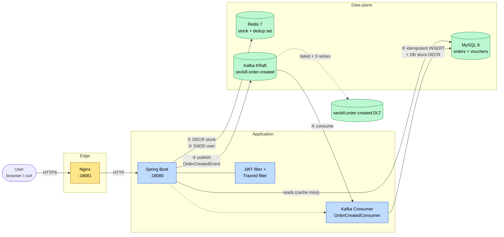
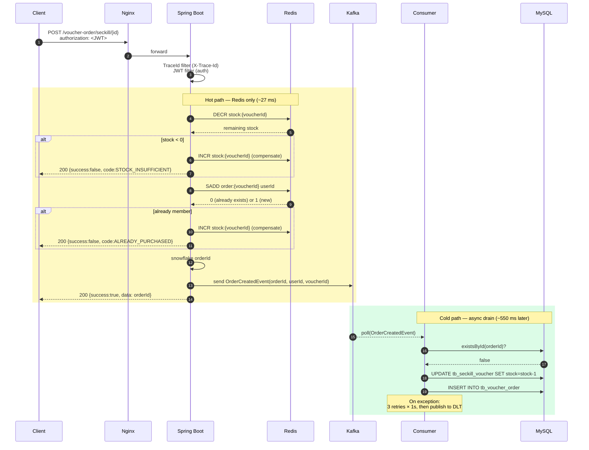

# CityFlow
[](https://github.com/Ultracheese1007/CityFlow/actions/workflows/ci.yml)


> A modular backend for a city review & seckill platform. Built to demonstrate
> Redis-backed distributed locking, JPA/Flyway-managed schema, JWT auth, and
> Docker-based local deployment.

## Why this project

CityFlow is a cloud-ready backend for a city review & seckill platform —
users browse shops, post reviews, and compete for limited-edition flash-sale
vouchers. The codebase exercises the patterns a typical high-traffic
e-commerce backend needs:

- **Spring Boot + JPA + Flyway** for a versioned, reproducible data layer,
  evolved through stage→merge migrations
- **Spring Security + JWT** for stateless authentication
- **Redis + Redisson** for cache-aside reads and distributed locks
  (e.g. cache rebuild on shop queries)
- **Async seckill via Redis + Kafka** — HTTP path performs atomic stock
  `DECR` and duplicate-user `SADD` against Redis, publishes an
  `OrderCreatedEvent`, and returns the order ID immediately (~27 ms).
  A `@KafkaListener` drains events to MySQL asynchronously with idempotent
  inserts. DB write pressure is smoothed; HTTP latency drops ~3×.
- **Structured error handling + traceId** — every request gets an 8-char
    trace ID echoed in `X-Trace-Id`; failures return stable error codes like
    `VOUCHER_NOT_FOUND` instead of free-text strings, so logs and clients
    can branch reliably
- **Docker Compose** for a one-command local stack;
  **GitHub Actions** ships the image to GHCR on every push to `main`
- - **Spring Boot Actuator** — `/actuator/health` + `/actuator/info` for ops
    visibility and Kubernetes-style liveness/readiness probes
- See [docs/DESIGN.md](docs/DESIGN.md) for architecture decisions and [docs/DEMO.md](docs/DEMO.md) for a 5-minute walkthrough.

## Architecture



**Reading guide**: The seckill path is split. Steps ①②③ happen on the HTTP
thread (~27 ms) — Redis enforces correctness atomically and Kafka acts as a
durable buffer. Steps ④⑤ drain asynchronously to MySQL with idempotent
inserts, smoothing DB write pressure. Failed events route to a dead-letter
topic after 3 retries.

### Seckill request flow



**Key properties**:
- **Atomic correctness in Redis** — `DECR` + `SADD` are single-key atomic
  ops; compensating `INCR` on failure keeps the counter consistent
- **Bounded HTTP latency** — 1 Redis RTT + 1 Kafka send + return; no DB I/O
  on the request thread
- **Idempotent consumer** — `existsById` guards against Kafka redelivery,
  so at-least-once delivery becomes effective exactly-once at the app layer
- **Failure isolation** — bad events go to the DLT after 3 retries, never
  block the main topic

## Tech stack

| Layer | Choice | Version | Why |
|---|---|---|---|
| Language | Java    | 17 |
| Framework | Spring Boot | 2.7.18 | Batteries-included |
| ORM | Spring Data JPA + Hibernate | 5.6 | Repository pattern, declarative tx |
| Mapping | MapStruct | 1.5 | Compile-time DTO ↔ entity conversion |
| DB | MySQL | 8.0 | Relational baseline |
| Migration | Flyway | 10.17 | Versioned, reproducible schema |
| Cache & lock | Redis + Redisson | 7 / 3.23 | Cache-aside + distributed RLock |
| Messaging | Kafka (KRaft mode) | 3.5 (Confluent 7.5) | Async order pipeline; KRaft = no Zookeeper |
| Auth | Spring Security + jjwt | 5.7 / 0.11.5 | Stateless JWT in `Authorization` header |
| Reverse proxy | Nginx | 1.25 | Upstream routing + static assets |
| Build | Maven | 3.x | Standard JVM build |
| Container | Docker + Compose | v2 | One-command local stack |
| CI | GitHub Actions | — | Build + push image to GHCR |
| Tests | JUnit 5 + Mockito + EmbeddedKafka | — | 17 tests; consumer integration covered with embedded broker |
| Logging | SLF4J + Logback + MDC | — | Per-request traceId, structured exception logging |

## Quick start (5 minutes)

```bash
git clone https://github.com/Ultracheese1007/CityFlow.git
cd CityFlow
docker compose up -d
```

The stack boots MySQL, Redis, Kafka (KRaft mode), Nginx, and the Spring Boot
app, with Flyway auto-applying schema migrations on first run.

Verify the app is healthy:

```bash
$ curl -s http://localhost:8080/actuator/health
{"status":"UP"}

$ curl -s http://localhost:8080/actuator/info
{"app":{"name":"CityFlow","description":"City review & seckill platform with async Kafka order pipeline","version":"0.1.0"},"java":{"version":17}}
```

To run the test suite (no Docker required — uses H2 + EmbeddedKafka):

```bash
./mvnw test
```


## API examples

### Successful seckill (full happy path)

```bash
$ time curl -i -X POST http://localhost:8080/voucher-order/seckill/3 \
       -H "authorization: $TOKEN"

HTTP/1.1 200
X-Trace-Id: 4aa2e5f4
Content-Type: application/json

{"success":true,"data":589965340662824961}

real    0m0.027s
```

The 27 ms response is Redis-only — the HTTP thread publishes an
`OrderCreatedEvent` to Kafka and returns. Logs reveal the decoupled timeline:

```
20:06:50.902 INFO  [4aa2e5f4] VoucherOrderServiceImpl  : Seckill order published: orderId=589965340662824961 stockRemaining=98
20:06:51.162 INFO  [        ] OrderCreatedConsumer     : Consuming order event: orderId=589965340662824961
20:06:51.451 INFO  [        ] OrderCreatedConsumer     : Order 589965340662824961 persisted successfully
```

DB persistence completes ~550 ms after HTTP returned. Stock counters in
Redis and MySQL converge to 98 once the consumer drains.

### Repeat purchase (Phase 3 structured error)

```bash
$ curl -i -X POST http://localhost:8080/voucher-order/seckill/3 \
       -H "authorization: $TOKEN"

HTTP/1.1 200
X-Trace-Id: 8bf31dd5
Content-Type: application/json

{"success":false,"code":"ALREADY_PURCHASED","errorMsg":"用户已经购买过一次"}
```

Stable error codes (`ALREADY_PURCHASED`, `VOUCHER_NOT_FOUND`,
`STOCK_INSUFFICIENT`...) let the front-end branch on machine-readable
identifiers rather than free-text messages. The matching `X-Trace-Id`
header lets ops `grep` the full request chain by ID — a single grep
retrieves JWT auth, Service calls, Redis operations, and any errors
under one tag.


## Project structure

```
.
├── docker-compose.yml          # MySQL + Redis + Kafka + Nginx + app
├── Dockerfile                  # Spring Boot fat jar runtime image
├── pom.xml
├── ops/
│   ├── flyway/                 # Seed data + Python script for legacy TSV imports
│   └── nginx/                  # Upstream config + static assets + access logs
├── src/
│   ├── main/
│   │   ├── java/com/cityflow/
│   │   │   ├── controller/     # REST endpoints
│   │   │   ├── service/        # Business logic (interfaces + impl)
│   │   │   ├── repository/     # Spring Data JPA repos
│   │   │   ├── entity/         # JPA entities
│   │   │   ├── dto/            # Request/response DTOs + ErrorCode enum
│   │   │   ├── kafka/          # OrderCreatedEvent, consumer, topics, stock initializer
│   │   │   ├── config/
│   │   │   │   ├── kafka/      # DefaultErrorHandler + DLT routing
│   │   │   │   ├── security/   # JWT filter + auth entry point
│   │   │   │   └── web/        # TraceIdFilter (MDC), CORS, global exception advice
│   │   │   ├── exception/      # BizException hierarchy
│   │   │   └── utils/          # RedisConstants, UserHolder, key builders
│   │   └── resources/
│   │       ├── application.yaml
│   │       └── db/migration/   # Flyway versioned migrations (V1__, V2__, ...)
│   └── test/                   # 17 tests: unit, repository, EmbeddedKafka integration
└── .github/workflows/          # CI: build + test + image push to GHCR
```


